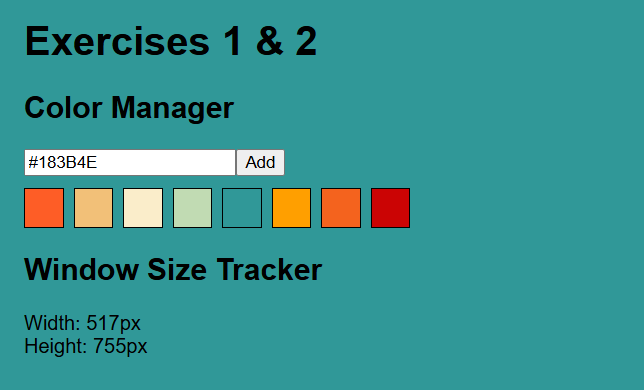
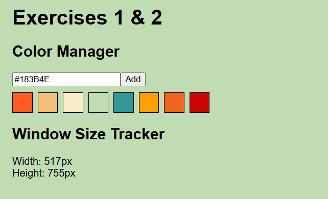
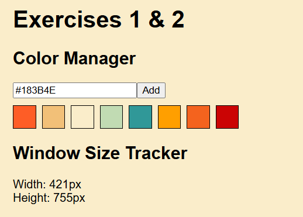

# React + TypeScript Exercises with Vite

This project contains two beginner-level React exercises built using **Vite**, **TypeScript**, and **functional components with hooks**. It's designed to help reinforce core React concepts such as state management, event handling, and lifecycle effects.

## 🚀 Setup

Clone the project:
```bash
git clone https://github.com/nicopanozo/frontend-bootcamp-p9.git
```

To run the project locally:

```bash
cd frontend-bootcamp-p9
cd practice9
npm install
npm run dev
```

## 📂 Project Structure
- src/App.tsx: Main component that renders both exercises.

- src/components/ColorManager.tsx: Lets users add hex colors and change the page background.

- src/components/WindowSizeTracker.tsx: Displays the current window size and updates on resize.

- src/main.tsx: Entry point that renders the app.

- index.html: HTML template used by Vite.

## 🧩 Exercises
### 1. Color Manager
- Input a hex color code (e.g. #ff0000) and click "Add".

- The color is added as a swatch below.

- Clicking a swatch changes the background color of the page.

### 2. Window Size Tracker
- Displays the current window width and height.

- Automatically updates when the window is resized.

## 🛠 Built With

- React
- TypeScript
- Vite

## 🧠 Learning Goals
- Practice how to use useState and useEffect.

- Handle form input and events.

- Dynamically render components using .map().

- Listen to and clean up browser events (resize).

- Validate user input using regular expressions.

📸 Screenshots






📄 License
This project is open source and available under the MIT License.